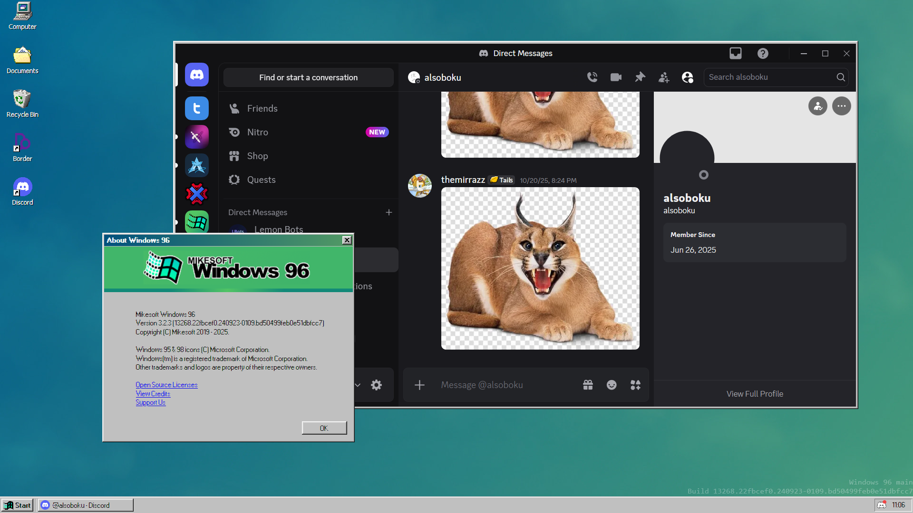

# Proxy for Discord port for [Windows 96](https://windows96.net/)
This allows you to use the Discord desktop app from Windows 96 - even on devices that don't support the desktop app (eg your smart fridge 😳)

## How to install the proxy
### Prerequisites:
* Windows 10 or newer
* macOS 10.15 or newer
* Linux 3.2 or newer
* Node.js 18 or newer
  * To install Node on Windows, download it from the official website: [Node.JS v22.21.0 - Windows Installer](https://nodejs.org/dist/v22.21.0/node-v22.21.0-x64.msi) [Node.JS v22.21.0 - Standalone Binary](https://nodejs.org/dist/v22.21.0/node-v22.21.0-win-x64.zip)
  * To install Node on macOS, download it from the official website: [Node.JS v22.21.0 - macOS Installer](https://nodejs.org/dist/v22.21.0/node-v22.21.0.pkg)
  * To install Node on Debian Linux or Debian-based distros, run the command `sudo apt upgrade && sudo apt install nodejs`.
  * To install Node on Arch Linux or Arch-based distros, run the command `sudo pacman -Syu nodejs`.
* Git (optional)

### Step 1. Download the proxy
You can run `git clone https://github.com/themirrazz/discord96-proxy` to download the proxy. Additionally, you can also go to the `Releases` tab if you don't have git to download `proxy.zip`.
If you're using the ZIP version, extract the ZIP into a new folder.

### Step 2. Run the proxy
Open a terminal of your choice in the folder you extracted and run `node index.js`.

## How to install the client application
### Prerequisites:
* Chrome, Firefox, Edge, Safari, or another browser with service worker support
  * **Warning:** Brave is **NOT** compatible with the client application.
  * Firefox works well during testing. Some issues arise while using Electron.
  * Servo does NOT support Service Workers!
* Make sure that `https://packages.themirrazz.vercel.app/` is one of your package manager sources.

### Step 1. Open the package manager
Open the package manager by going to `Start > Programs > System > Package Manager`.

### Step 2. Install the package
Look for the package titled `discord-localhosted` or `Discord (Localhosted)`. If you can't find it, try selecting the `Social` category.

### Step 3. Acknowledge the popups that appear after install
It will ask you if you want to launch Discord when you boot up Windows 96, and if you want to add a shortcut to it on your desktop.

### Step 4. Make sure the proxy is started.
For more information, see the [how to install the proxy](#how-to-install-the-proxy) section.

### Step 5. Launch the app
You can find the app in `Start > Programs > Network > Discord (Localhosted)`.
